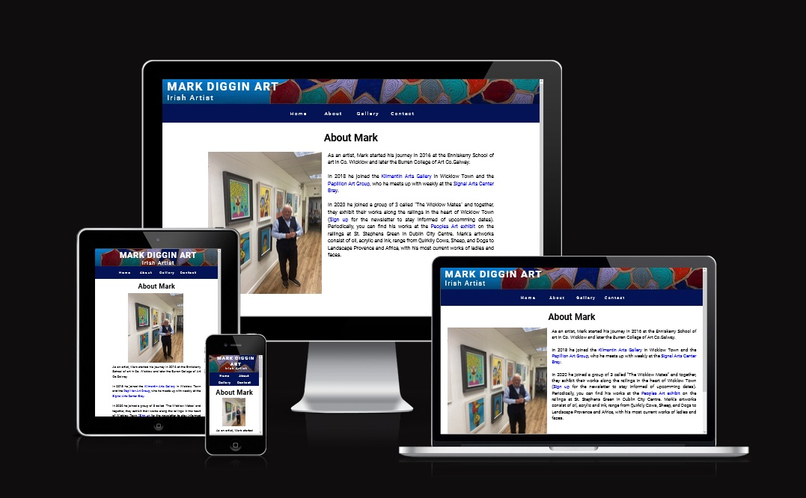
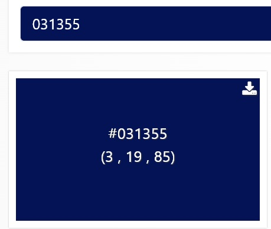
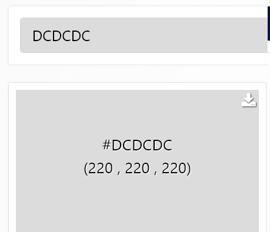
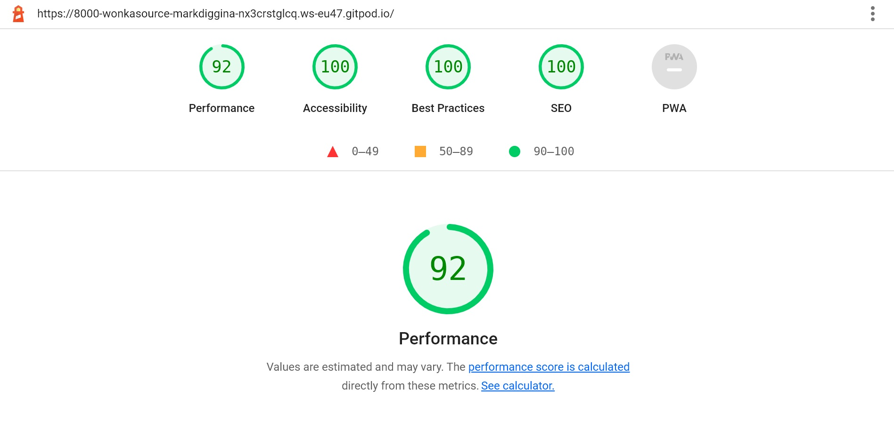

# Daniel Diggin

## Mark Diggin Art
A website for an Irish artist from Co. Wicklow Ireland. This website is to promote the  
of the artworks of Irish artist Mark Diggin.    

[View deployed site here](https://wonka-source.github.io/mark-diggin-art-pp1/)

## UX

### Strategy
My goal in the design was to make a functioning website with easy access to all the information available in a user-friendly format.

### Scope
For the user, I wanted them to be able to browse through the different works created by the artist, learn a summary of his background with the option to contact him and have an opportunity to sign up for a newsletter to keep up to date with the artist's current happenings. 

### Structure
The site is made of four main pages starting with the home as the main site navigation hub, from there the user is able to browse to the about section to get a summery of the artist. Using the navigation bar the user can browse to the gallery page to view the artists artworks. Then the final page is a contact form where the user can interact with the artist and sign up for the newsletter.

### Skeleton
[Home](other-files/mark-diggin-art%20-home-page.jpg)
[About](other-files/mark-diggin-art-about.jpg)
[Gallery](/other-files/mark-diggin-art-rtwork.jpg)
[Contact](/other-files/mark-diggin-art-contact..jpg)

### Surface
The primary colors used were #031355 for the navigation bar and #DCDCDC for the footer, with the rest in white. I chose these colors as they complement the hero image and do not clash with any colors from the paintings displayed on the gallery page while keeping the content legible.

### Technologies
1. HTML
2. CSS

### Features
This site features a navigation bar, a gallery, a home menu page, links to social media, a contact form,  a you-tube video and links to external resources.
### Features Left to Implement
In the future, I would like to add a feature that allows the user to view the art in a virtual sitting/room hall or bedroom to get an idea of how it may look, along with the ability to purchase off the site.

## Testing
##  Tests that were run on all pages

 - Test label  **Logo link**
 - Test action **Click on logo**
 - Expected outcome **Load home page**
 - Test outcome **Pass**
# .
- Test label  **Nav home**
 - Test action **Click on home on the navigation  bar**
 - Expected outcome **Load home page**
 - Test outcome **Pass**
# .
- Test label  **Nav about**
 - Test action **Click on about on the  navigation bar**
 - Expected outcome **Load about page**
 - Test outcome **Pass**
# .
- Test label  **Nav gallery**
 - Test action **Click on gallery on the  navigation bar**
 - Expected outcome **Load gallery page**
 - Test outcome **Pass**
# .
- Test label  **Nav contact**
 - Test action **Click on contact on the navigation bar**
 - Expected outcome **Load contact page**
 - Test outcome **Pass**
# .
- Test label  **Facebook Icon**
 - Test action **Click on Facebook Icon**
 - Expected outcome **Load Facebook page opens in a new tab**
 - Test outcome **Pass**
# .
- Test label  **Instagram Icon**
 - Test action **Click on Instagram Icon**
 - Expected outcome **Load  Instagram  page opens in a new tab**
 - Test outcome **Pass**
# .
- Test label  **Twitter Icon**
 - Test action **Click on Twitter Icon**
 - Expected outcome **Load Twitter page opens in a new tab**
 - Test outcome **Pass**
# .
## Tests run on just the home page

- Test label  **About Mark**
 - Test action **Click on About Mark Image**
 - Expected outcome **Go to the about page**
 - Test outcome **Pass**
# .
- Test label  **Gallery/Artworks**
 - Test action **Click on Gallery/Artworks Image**
 - Expected outcome **Go to the gallery page**
 - Test outcome **Pass**
# .
- Test label  **Contact Mark**
 - Test action **Click on Contact Mark Image**
 - Expected outcome **Go to the contact page**
 - Test outcome **Pass**
# .

## Tests that were run on just the about page

- Test label  **Kilmantin arts gallery**
 - Test action **Click on Kilmantin arts gallery link**
 - Expected outcome **Open kilmantin arts gallery in a new tab**
 - Test outcome **Pass**
# .
- Test label  **Signal arts**
 - Test action **Click on signal arts center**
 - Expected outcome **Go to the signal arts centers page in a new tab**
 - Test outcome **Pass**
# .
- Test label  **Peoples art**
 - Test action **Click on peoples art link**
 - Expected outcome **Go to the peoples art website opens in a new tab**
 - Test outcome **Pass**
# .
- Test label  **Contact Mark**
 - Test action **Click on Contact Mark Image**
 - Expected outcome **Go to the contact page**
 - Test outcome **Pass**
# .

## Tests that were run on just the contact page
- Test label  **Full name required **
 - Test action **Leave full name section blank on the form**
 - Expected outcome **"Please fill in this field pop up**
 - Test outcome **Pass**
# .

- Test label  **Subject required **
 - Test action **Leave subject section blank on the form**
 - Expected outcome **"Please fill in this field pop up**
 - Test outcome **Pass**
# .
- Test label  **Email required **
 - Test action **Leave email section blank on the form**
 - Expected outcome **"Please fill in this field pop up**
 - Test outcome **Pass**
# .
- Test label  **Include @ **
 - Test action **Leave out @ in email section**
 - Expected outcome **"Please include @ pop up**
 - Test outcome **Pass**
# .
- Test label  **Message required **
 - Test action **Leave message section blank**
 - Expected outcome **"Please fill in this field pop up**
 - Test outcome **Pass**
# .
- Test label  **Completed form **
 - Test action **Fill out the form completely **
 - Expected outcome **"Load submission-sucessful.html**
 - Test outcome **Pass**
# .
## This test was run on only submission-sucessful.html
- Test label  **Play video **
 - Test action **Play video**
 - Expected outcome **"Video plays **
 - Test outcome **Pass**
# .
## Browsers and Devices
This site was tested across multiple browsers ie. Chrome, Firefox, Edge, Opera, Brave and Edge.
The site was also tested on multiple mobile devices iPhone 6, 7, 12pro, iPad, Samsung Galaxy and Alcatel one plus to ensure compatibility and responsiveness. 
## Other tests
[W3C CSS](other-files/w3c%20CSS.jpg)
[W3C HTML](other-files/w3c%20html.jpg)

## Deployment
The site is hosted using GitHub Pages and deployed directly from the master branch. The deployed site will update automatically upon new commits to the master branch. For the site to deploy correctly on GitHub pages, the home page must be named index.html.

To run locally, you can clone this repository directly into the editor of your choice by pasting "git clone https://github.comWonka-source/**mark-diggin-art-pp1.**git" into your terminal.
## Credits
### Content
Content in the about section came from an interview with the artist.

### Media 
All photos were submitted to me by the artist himself, the video that plays on the submission-successful.html page came from [Pervaneh Matthews You Tube channel](https://www.youtube.com/user/pervanehmatthews)

### Acknowledgements
The gallery arrangement i found on stack overflow [here](https://stackoverflow.com/questions/56103364/zigzag-order-using-grid-template-columns-repeatauto-fit-minmax10em-1fr)
The form was done through following lessons from [Code Institute](https://codeinstitute.net/ie/)
I'd like to thank my mentor Brian Macharia for guiding me along the way. 
**This site was made for educational purposes**
